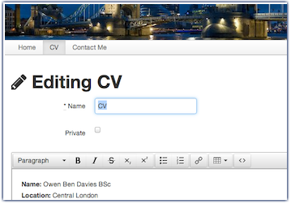

CMS
===

[](https://travis-ci.org/obduk/cms)
[](https://gemnasium.com/obduk/cms)
[](https://codeclimate.com/github/obduk/cms)
[](https://coveralls.io/r/obduk/cms)

A Content Management System (CMS) written with Ruby on Rails and CouchDB.
Although it is a working project, it was not created with the intention of being
a production system. Instead this has been my practice project over the years,
used for testing new ideas. For example, this project originally used MySQL,
however I switched it to use CouchDB after doing performance checks.

For an example, check out my personal website at http://www.obduk.com



Dependencies
------------

You will need a system running the following software:

* Ruby
* Bundler
* CouchDB
* Imagemagick
* Mailcatcher (For development)

For more detailed dependencies, this is the project I use for setting up my
development and live server: https://github.com/obduk/server_setup

Setup
-----

First run the following to setup the project.

```shell
./bin/bootstrap
```

Test
----

To run the tests run the following to make sure your system is set up correctly.

```shell
./bin/test
```

Or you can run one test file:

```shell
./bin/test spec/some_file.rb
```

Setup data
----------

Currently it is only possible to create sites and users via the command line.
To set up data for your development server, run the following:

```shell
./bin/interactive
```

First we need to create the features object, used to enable or disable features.

```ruby
Features.new.save!
```

Next create an account to use, replacing email, password and sites with
appropriate data.

```ruby
account = Account.new
account.email = 'test@example.com'
account.password = 'password'
account.password_confirmation = 'password'
account.sites = ['localhost']
account.save!
```

Finally create the site, replacing host and name with appropriate data.

```ruby
site = Site.new
site.host = 'localhost'
site.name = 'Test Site'
site.updated_by = account.id
site.save!
```

Development
-----------

Run the following to spin up a server locally for development:

```shell
./bin/server
```

Deployment
----------

This project can either be deployed on a Linux server like Ubuntu, or deployed
to Heroku. It also uses cloud storage for asset serving.

* [Deployment Cloud Storage](docs/deployment_cloud_storage.md)
* [Deploy to Heroku](docs/deploy_to_heroku.md)
* [Deploy to Server](docs/deploy_to_server.md)
